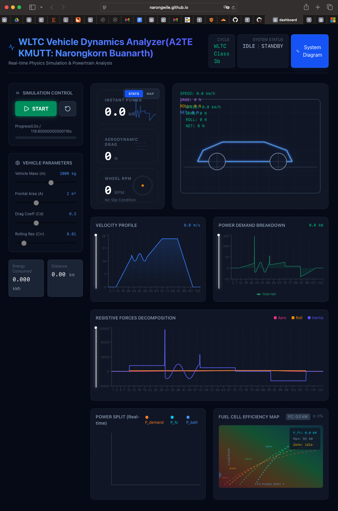
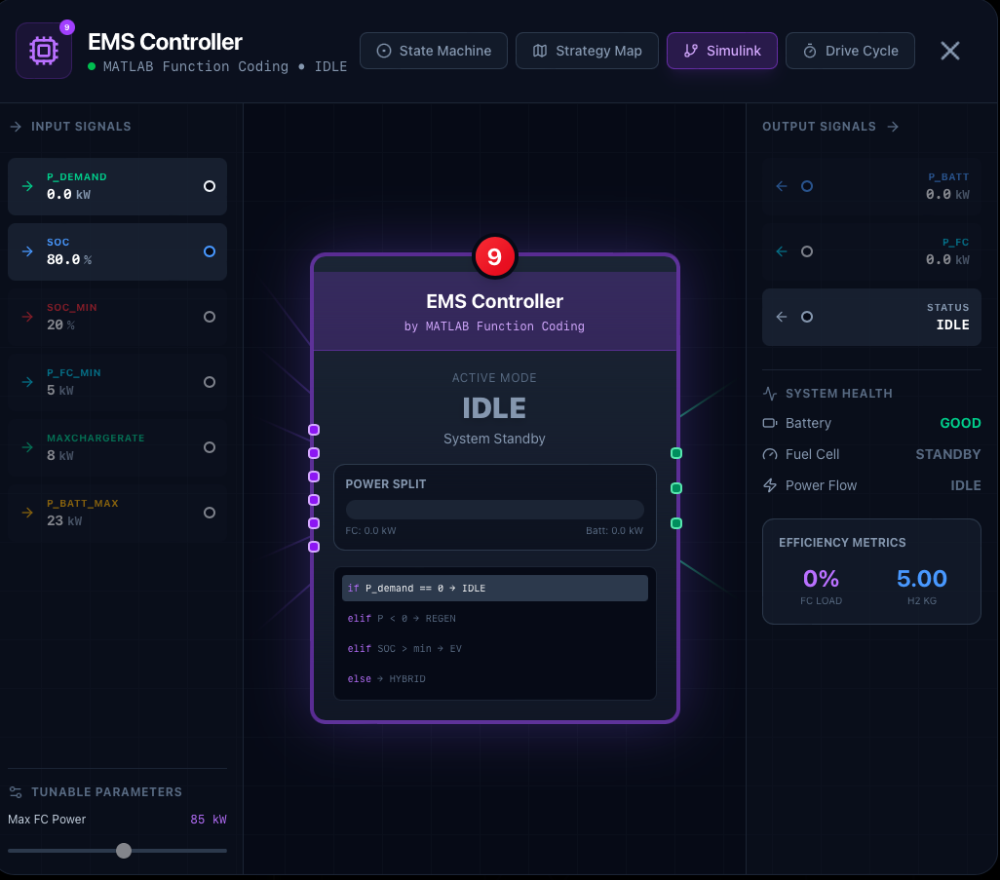

# WLTC Vehicle Dynamics Analyzer

> **A2TE KMUTT: Narongkorn Buanarth**  
> Real-time Physics Simulation & Powertrain Analysis for FCEV

[](https://narongwile.github.io/WLTC-dashboard/)
[](https://reactjs.org/)
[](https://www.typescriptlang.org/)
[](https://vitejs.dev/)

## 🔗 Live Demo

**[https://narongwile.github.io/WLTC-dashboard/](https://narongwile.github.io/WLTC-dashboard/)**

---

## 🚗 Overview

This dashboard provides real-time simulation and visualization of a **Fuel Cell Electric Vehicle (FCEV)** operating on the WLTC (Worldwide harmonized Light vehicles Test Cycle). It includes:

- **Real-time physics simulation** (aerodynamic drag, rolling resistance, inertia)
- **Energy Management System (EMS)** with rule-based power split
- **Interactive powertrain schematics** with component inspection
- **Live charts** for velocity, power, and efficiency analysis

---

## 📸 Screenshots

### Main Dashboard


Real-time WLTC simulation with:
- Velocity & Power profiles
- Force decomposition charts
- Power Split (P_demand vs P_fc vs P_batt)
- Fuel Cell Efficiency Map

---

### Powertrain Schematics


Interactive system diagram showing:
- H2 Tank → Fuel Cell → EMS → Inverter → Motor → Wheels
- Real-time energy flow visualization
- Click any block for detailed inspection

---

### EMS Controller (Simulink-style)


Advanced EMS visualization with:
- **State Machine** (IDLE → EV → HYBRID → REGEN)
- **Strategy Map** visualization
- **Simulink-style block diagram**
- **Driving Cycle** view

---

## ⚡ Features

| Feature | Description |
|---------|-------------|
| **WLTC Simulation** | Real-time vehicle dynamics with WLTC Class 3b cycle |
| **Physics Engine** | Aerodynamic, rolling resistance, and inertia calculations |
| **FCEV Powertrain** | H2 tank, Fuel Cell, HV Battery, Motor simulation |
| **EMS Logic** | Rule-based power management (EV/HYBRID/REGEN modes) |
| **Interactive Schematics** | Click components to view detailed telemetry |
| **Power Split Chart** | Real-time P_demand vs P_fc vs P_batt visualization |
| **Efficiency Map** | FC operating point with efficiency zones |
| **Adjustable Parameters** | Mass, Cd, Crr, Frontal Area sliders |

---

## 🛠️ Tech Stack

- **Frontend:** React 18 + TypeScript
- **Build:** Vite 5
- **Charts:** Recharts
- **Styling:** TailwindCSS
- **Icons:** Lucide React
- **Deployment:** GitHub Pages

---

## 🚀 Getting Started

```bash
# Clone repository
git clone https://github.com/narongwile/WLTC-dashboard.git
cd WLTC-dashboard

# Install dependencies
npm install

# Run development server
npm run dev

# Build for production
npm run build
```

---

## 📁 Project Structure

```
dashboard/
├── src/
│   ├── App.tsx              # Main dashboard component
│   ├── types.ts             # TypeScript type definitions
│   ├── components/
│   │   ├── CarSchematic.tsx      # Vehicle visualization
│   │   ├── SchematicModal.tsx    # Powertrain diagram
│   │   ├── StatCard.tsx          # Stats display cards
│   │   └── details/
│   │       ├── EMSDetail.tsx     # EMS controller modal
│   │       ├── EMSmain.tsx       # Simulink-style view
│   │       ├── DrivingCycle.tsx  # Velocity/Accel charts
│   │       ├── BatteryDetail.tsx # Battery telemetry
│   │       ├── MotorDetail.tsx   # Motor telemetry
│   │       └── FuelCellDetail.tsx# FC telemetry
│   └── ...
├── vite.config.ts
└── package.json
```

---

## 📊 Physics Model

### Force Calculation
```
F_total = F_aero + F_roll + F_inertia

F_aero = 0.5 × ρ × Cd × A × v²
F_roll = Crr × m × g
F_inertia = m × a
```

### EMS Power Split Logic
```
if P_demand ≤ 0:        → REGEN (charge battery)
elif P_demand < 20kW:   → EV mode (battery only)
else:                   → HYBRID (FC + battery)
```

---

## 👨‍💻 Author

**Narongkorn Buanarth**  
A2TE KMUTT (Automotive Technology and Engineering)

---

## 📜 License

MIT License - feel free to use and modify for educational purposes.
